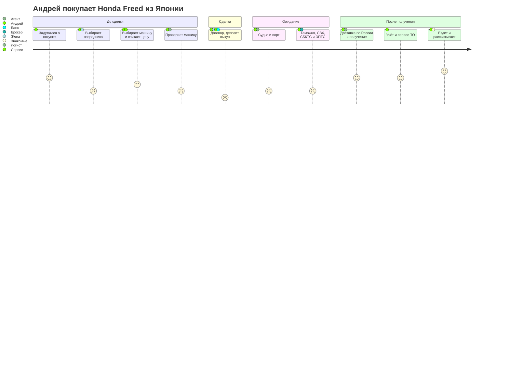
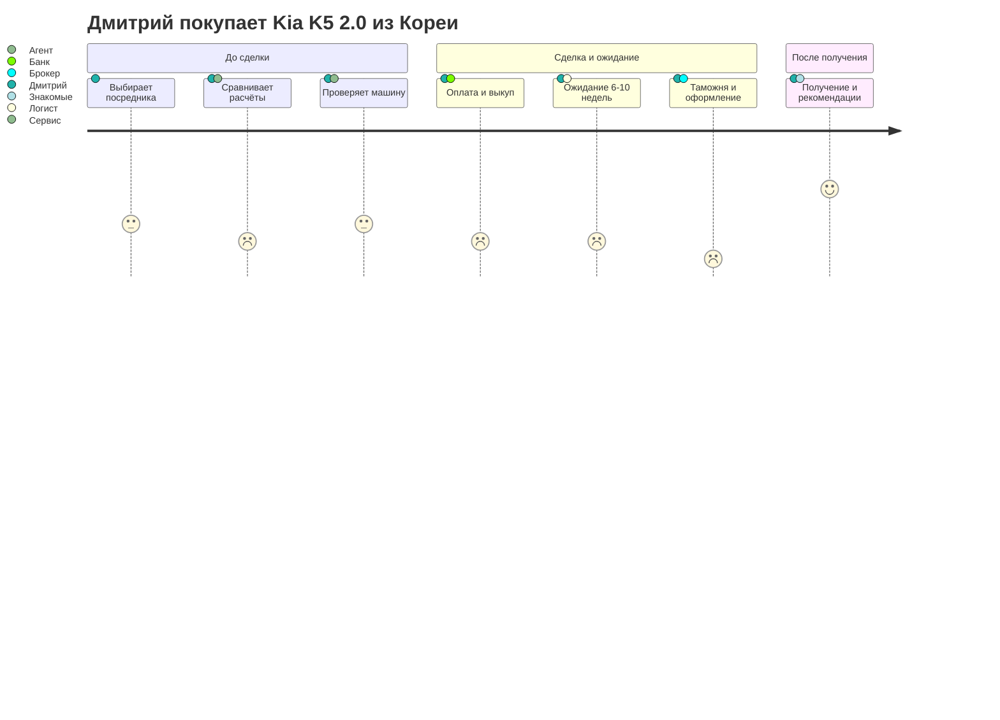

# CJM: покупка машины из Японии через сервис-агента

Для слайдов: 3 (Проблема: где путь рвётся и почему), 4 (Решение: что закрываем на каждом этапе), 9 (Гипотезы из карты), 10 (Дорожная карта: этапы сделки).

> **Персона:** Андрей, 35 лет, Новосибирск, впервые покупает машину из-за рубежа, семья, бюджет до 2,2 млн ₽ под ключ (`discovery/personas/andrey-first-import.md`).
> **Сценарий:** купить семейную машину из Японии — Honda Freed 1.5 (бензин, до 160 л.с.) или Toyota Corolla Fielder — до 2,2 млн ₽ под ключ за 3–4 месяца (по самой карте путь занимает до ~3,7 месяца: 2–4 недели выбора + до 3 месяцев доставки). Сценарий «Kia Sorento 2021 из Кореи» из исходного контекста заменён: Sorento 2.5 запрещён к вывозу из Кореи и мощнее 160 л.с. (И6, `changes-log.md` п. 8).
> **Что есть из исследования:** реальных интервью **нет** — пометки `[данные интервью]` в карте не встречаются. Используются `[аналитика]` (источники S00/S02) и `[ДОПУЩЕНИЕ]`.
> **Основано на:** бриф S01, персоны S03, рынок S02, аудит S00. Формат — раздел 8 `input/avto-iz-azii-context.md`.

---

## Вопросы к себе перед картой (автономный режим, раздел 8, п. 1)

| # | Вопрос | Ответ из данных | Основание |
|---|---|---|---|
| 1 | С чего начинается путь — что запускает покупку? | Старая машина требует замены, семья растёт; на рынке РФ за те же деньги — машины старше | [ДОПУЩЕНИЕ] |
| 2 | Где человек ищет информацию? | Telegram-каналы, Дром (раздел «Авто под заказ», калькулятор), отзывы, знакомые | [аналитика: S02, разделы 1–2] |
| 3 | Сколько длится путь? | 2–4 недели выбора [ДОПУЩЕНИЕ] + 1,5–3 месяца доставки и оформления | [аналитика: S00, находка 7; S02, раздел 5.4] |
| 4 | Сколько и когда он платит? | Возвратный депозит 15–100 тыс. ₽ у посредников, потом полная стоимость машины при выкупе, затем пошлина, доставка, комиссия | [аналитика: S02, разделы 1 и 8] |
| 5 | Где он может отказаться? | При первом расчёте цены (дороже ожиданий), при просьбе внести крупную предоплату, во время долгого ожидания без новостей | [ДОПУЩЕНИЕ] |
| 6 | Какие этапы проходят без нас? | Ожидание судна, таможня, СВХ, лаборатория СБКТС/ЭПТС, постановка на учёт, первое ТО | [аналитика: S00, 3.6, 8.2] |
| 7 | Чего мы не знаем совсем? | Какой страх главный, как долго выбирают, как часто решение семейное, реальную разницу «обещано / заплачено» | → гипотезы ниже |

---

## Карта: этапы × параметры

Шкала эмоций: −2 (страх, злость) … 0 (нейтрально) … +2 (радость, уверенность).

| Параметр | 1. Задумался о покупке | 2. Выбирает способ и посредника | 3. Выбирает машину и считает цену | 4. Проверяет машину и решает | 5. Договор, депозит, выкуп |
|---|---|---|---|---|---|
| **Цель** | Понять, реально ли купить нормальную машину за 2 млн ₽ | Найти, кому можно доверить деньги | Найти подходящую машину в бюджете и понять полную цену | Убедиться, что машина не битая | Заплатить и не потерять деньги |
| **Действия (в т. ч. вне нас)** | Смотрит цены на Авито/Дроме; слышит от коллеги про пригон; читает Telegram-каналы | Читает отзывы, сравнивает 3–5 посредников, спрашивает знакомых, запрашивает расчёты | Листает аукционы Японии, выбирает Freed / Fielder, считает в калькуляторах, узнаёт про 160 л.с. и запрет гибридов | Читает аукционный лист (Япония), просит фото/видео, смотрит историю | Подписывает агентский договор, вносит депозит, потом полную оплату для выкупа |
| **Точки контакта** | Авито, Дром, Telegram, коллеги | Сайты посредников, отзывы, Drive2, Дром | Каталоги аукционов, калькуляторы, менеджер посредника | Аукционный лист, менеджер, агент в Японии | Договор, банк, менеджер |
| **Мысли и вопросы** | «В России дорого и старьё. А там правда дешевле?» | «Кому верить? Вдруг это как Din-X?» | «А что ещё добавят? Почему у всех разные суммы?» | «Я не вижу машину вживую — а если там ржавчина?» | «Отдаю миллионы незнакомым людям. Что будет, если они пропадут?» |
| **Эмоция** | **+1** | **−1** | **0** | **−1** | **−2** |
| **Почему такая эмоция** | Надежда: пригон рассматривают 31% планирующих покупку [аналитика: Выберу.ру/Известия, 24.07.2026, S02] | Тревога: ~100 мошеннических каналов «перегона» [аналитика: BI.ZONE, 04.08.2025, S02] и дела о мошенничестве | Азарт от выбора гасит путаница в статьях цены: 8–10 статей, курс, утильсбор [аналитика: S00, 1.1] | Для Японии есть аукционный лист — это частично успокаивает, но язык и оценки непонятны [аналитика: S02, раздел 1] | Пик страха: предоплата — главный риск [аналитика: дела Din-X, Приморье, S00] |
| **Барьеры и боли** | Не знает, с чего начать; не понимает ограничения (1,9 л, 160 л.с.) | Нет способа проверить честность посредника; проплаченные отзывы [аналитика: S00, находка 9] | Расчёты разных посредников расходятся; скрытые статьи 100–300 тыс. ₽ в единичных кейсах [аналитика: S02, раздел 6] | Нет независимого взгляда; в Корее осмотр 20–30 тыс. ₽ [аналитика: S02] | Крупная сумма у компании без банковской защиты; перевод за рубеж через платёжного агента [аналитика: S00, находка 4] |
| **Что нас спасёт (идея)** | Короткое объяснение «что можно везти в 2026 и сколько это стоит» | Деньги до выкупа — в банке (аккредитив), публичный договор, фиксированная комиссия | Цена под ключ по статьям с диапазоном по курсу; фильтр разрешённых машин | Перевод и разбор аукционного листа; для Кореи/Китая — независимый осмотр | Аккредитив в пользу агента: деньги раскрываются после выкупа и документов [ГИПОТЕЗА: механизм, И2] |
| **Метрика этапа и как мерить** | Доля визитов, дошедших до расчёта цены — аналитика лендинга | Доля оставивших контакт после страницы «как защищены деньги» — лендинг | Разница нашего расчёта и расчётов 3–5 посредников — сверка (Г4а) | Доля заявок, где клиент запросил отчёт/перевод листа — консьерж-сделки | Доля заявок, внёсших депозит — консьерж / лендинг с реальным депозитом |

| Параметр | 6. Ожидание: судно и порт | 7. Таможня, СВХ, СБКТС/ЭПТС | 8. Доставка по России и получение | 9. Учёт в ГИБДД и первое ТО | 10. Ездит и рассказывает |
|---|---|---|---|---|---|
| **Цель** | Знать, что машина едет и всё идёт по плану | Пройти оформление без сюрпризов и доплат | Получить машину целой и в срок | Легально ездить, проверить машину у своего мастера | Убедиться, что решение было правильным |
| **Действия (в т. ч. вне нас)** | Ждёт ~4 недели до Владивостока (Япония; 2–6 недель в зависимости от аукциона и сезона) [аналитика: S02, раздел 5.4], следит за новостями, пишет менеджеру | Передаёт документы брокеру по доверенности, платит пошлину и сборы, ждёт лабораторию | Ждёт автовоз 1–3 недели, принимает машину, проверяет по акту | Ставит на учёт, делает ТО, меняет расходники | Рассказывает коллегам, отвечает в чатах, может посоветовать сервис |
| **Точки контакта** | Менеджер, мессенджер, трекинг | Брокер, СВХ, лаборатория, таможня | Автовоз, менеджер | ГИБДД / Госуслуги, СТО | Коллеги, чаты, отзывы |
| **Мысли и вопросы** | «Где машина? Почему менеджер молчит второй день?» | «Опять доплатить? Этого не было в расчёте!» | «А вдруг поцарапают в дороге?» | «Не будет ли проблем с документами?» | «Сэкономил или нет? Посоветовать ли?» |
| **Эмоция** | **−1** | **−1** | **+1** | **+1** | **+2** |
| **Почему такая эмоция** | Долгое ожидание без контроля; с июля по октябрь рейсы задерживаются тайфунами на 1–2 суток [аналитика: ai-import.ru, https://ai-import.ru/stati/avto-iz-yaponii-vladivostok, 2026 — по поисковой выдаче] | Этап, где возникают доплаты: СВХ, брокер 30–50 тыс. ₽, СБКТС/ЭПТС 30–35 тыс. ₽ [аналитика: vc.ru, S00 — цифры по Корее, для Японии порядок сумм принят тем же, ДОПУЩЕНИЕ] | Облегчение: машина рядом, но риск повреждений при перевозке [ДОПУЩЕНИЕ] | Формальности, но уже с машиной [ДОПУЩЕНИЕ] | Если цена и срок совпали с обещанием — гордость и желание рассказать [ДОПУЩЕНИЕ] |
| **Барьеры и боли** | 1,5–3 месяца ожидания [аналитика: S00, находка 7]; статус приходится выпрашивать | Неожиданные статьи; изменение курса на дату растаможки [ДОПУЩЕНИЕ: пошлина в евро пересчитывается по курсу на дату декларации]; порог 160 л.с. при ошибке в документах | Сроки автовоза 12–22 дня до Москвы [аналитика: S00]; до Новосибирска — не найдено, вероятно меньше [ДОПУЩЕНИЕ]; кто отвечает за повреждения | Возможные вопросы по документам; скрытые дефекты вылезают на ТО | Если обманули — негатив расходится так же быстро |
| **Что нас спасёт (идея)** | Статусы по документам (коносамент, фото погрузки), уведомления о каждом шаге | Все статьи оформления — в цене заранее; квитанции по каждой статье | Страховка перевозки; акт приёмки с фото «до/после» [ГИПОТЕЗА] | Памятка по учёту; процедура на случай скрытого дефекта [ГИПОТЕЗА] | Просьба об отзыве; программа «приведи друга» [ГИПОТЕЗА] |
| **Метрика этапа и как мерить** | Число обращений «где машина» на сделку — журнал оператора | Доля сделок с итогом в пределах обещанного диапазона — сверка расчёта и факта (Г4б) | Доля сделок, доставленных в обещанный срок — журнал сделок | Доля сделок с претензией по дефекту в первые 30 дней — журнал | Доля клиентов, пришедших по рекомендации — вопрос «откуда вы о нас узнали» |

---

## Диаграмма пути (Mermaid)

Эмоция −2…+2 переведена в шкалу Mermaid 1…5 (−2 → 1, −1 → 2, 0 → 3, +1 → 4, +2 → 5).

**Метрики карты:** средняя оценка 2,9 из 5; этапов с оценкой ≤ 2 — пять; самая слабая часть — «Сделка» (1,0), самая сильная — «После получения» (4,3).

---

## Моменты истины

1. **Этап 5 — «Отдать деньги».** Самая низкая эмоция (−2): здесь человек либо доверяет, либо откладывает покупку. Здесь рождается или умирает доверие. Реальные дела о мошенничестве — именно про этот момент: Din-X Auto забрала предоплаты 2–9 млн ₽ у более чем 250 клиентов [аналитика: Lenta.ru, https://lenta.ru/news/2026/06/01/krasnodarskaya-kompaniya-po-vvozu-mashin-ischezla-s-dengami-soten-klientov/, 01.06.2026].
2. **Этап 3 — «Первая полная цена».** Если первый расчёт выходит за бюджет или не сходится с расчётами других посредников, человек уходит к «купить в РФ» [ДОПУЩЕНИЕ]. Для Андрея это реально: Freed стоит 1,66–2,19 млн ₽ только до Владивостока [аналитика: S02, раздел 5.3].
3. **Этап 7 — «Доплата на таможне».** Первая неожиданная доплата ломает доверие, заработанное на этапе 5, и превращает клиента в антирекламу [ДОПУЩЕНИЕ]. Для опытной персоны Дмитрия (вымышленный образ) именно такой опыт — причина искать другого посредника [ДОПУЩЕНИЕ].

---

## Гипотезы из карты

Формат раздела 5 контекста. Пороги — стартовые, выборки пересчитываем в S07.

| № | Гипотеза |
|---|---|
| CJM-1 | **Если** до оплаты покажем, что деньги до выкупа лежат на аккредитиве в банке, а не у нас, для новичков-покупателей (Андрей), **то** больше людей внесёт возвратный депозит, **потому что** главный страх на этапе 5 — потеря предоплаты. **Подтверждена, если** из 10–12 интервью у ≥7 человек страх потери денег назван главным барьером, а в консьерж-режиме ≥3 из первых 10 заявок внесут реальный возвратный депозит за 3 недели. |
| CJM-2 | **Если** покажем цену под ключ по всем статьям с диапазоном по курсу, для всех покупателей, **то** больше людей после расчёта оставят заявку на подбор, **потому что** расчёты посредников расходятся и пугают скрытыми статьями. **Подтверждена, если** (а) доля посетителей лендинга, открывших расчёт по статьям и оставивших заявку, ≥2% при ≥150 визитах за 2 недели (порог и выборку уточнить в S07), и (б) условие точности: наш расчёт по 20 машинам расходится с расчётами 3–5 посредников не больше чем на 5% по сумме статей, которые посредники раскрыли, в ≥16 из 20 случаев, за 2 недели. |
| CJM-3 | **Если** будем подтверждать каждый статус документом или фото и присылать уведомление, для клиентов в ожидании, **то** число вопросов «где машина» упадёт, **потому что** тревога этапа 6 — от неизвестности. **Подтверждена, если** в первых 5 консьерж-сделках в среднем ≤1 такого обращения на сделку в неделю за время доставки. Базовый уровень у посредников неизвестен — уточнить в интервью S05. |
| CJM-4 | **Если** все статьи оформления (СВХ, брокер, СБКТС/ЭПТС) войдут в цену заранее, для всех покупателей, **то** итог совпадёт с обещанным, **потому что** доплаты возникают именно на этапе 7. **Подтверждена, если** (а) за 3 недели ретро-разбора у 5–7 человек, уже получивших машины, расхождение в ≥4 случаях возникло в основном на этих статьях, и (б) в первых 5 консьерж-сделках итог попадёт в обещанный диапазон в ≥4 из 5 случаев (срок — до получения 5-й машины, ~4 месяца). |
| CJM-5 | **Если** для Японии будем переводить и объяснять аукционный лист вместо отдельного осмотра, для покупателей японских машин, **то** они решатся без личного осмотра, **потому что** аукционный лист уже содержит оценку кузова и салона. **Подтверждена, если** ≥6 из 10 респондентов после разбора реального аукционного листа ответят, что им этого достаточно для решения, и назовут, чего не хватает, за 2 недели. |

---

## Сокращённая карта: Дмитрий (опытный покупатель, Kia K5 2.0 из Кореи)

Путь заметно отличается: этапы 1–2 короче и спокойнее, а пик тревоги смещён на этап 7.

| Этап | Эмоция | Отличие от Андрея |
|---|---|---|
| 1–2. Задумался, выбирает посредника | **0** | Знает процесс, сразу запрашивает расчёты у 3–4 посредников; главное — не мошенничество, а прозрачность [ДОПУЩЕНИЕ] |
| 3. Машина и цена | **−1** | Сравнивает расчёты построчно, раздражается от неполных расчётов; K5 2.0 — 2,245 млн ₽ во Владивостоке + 180–230 тыс. ₽ автовоз до Москвы [аналитика: S02, раздел 5.3; Дром FAQ, 2026] |
| 4. Проверка | **0** | Сам проверяет историю, готов заплатить 20–30 тыс. ₽ за осмотр в Корее [аналитика: S02] |
| 5. Оплата | **−1** | Боится меньше, но знает про аккредитив у Encar Russia и Terminal A — ждёт того же [аналитика: S02, раздел 1] |
| 6. Ожидание (6–10 недель из Кореи) | **−1** | Дольше, чем из Японии [аналитика: S00, находка 7] |
| 7. Таможня | **−2** | Пик тревоги: в прошлый раз доплаты были именно здесь [ДОПУЩЕНИЕ, персона] |
| 8–10. Получение и дальше | **+1…+2** | Если итог совпал — рекомендует 2–3 знакомым [ГИПОТЕЗА] |

---

## Выявленные проблемы и что это значит для продукта

| # | Этап | Проблема | Что теряем | Куда передаём |
|---|---|---|---|---|
| 1 | 5 | Крупная предоплата без банковской защиты | Сделку целиком: человек откладывает покупку | S06 (модель оплаты), S07 (CJM-1), S10 (экран трекинга с этапами оплаты) |
| 2 | 3 | Первый полный расчёт выше ожиданий / расходится с другими | Клиента на входе | S07 (CJM-2), S10 (карточка авто) |
| 3 | 7 | Доплаты на оформлении | Доверие и рекомендации | S06 (все статьи в цене), S07 (CJM-4) |
| 4 | 6 | Долгое ожидание без новостей | Нервы клиента, нагрузку оператора | S08 (статусы), S10 (трекинг) |
| 5 | 9 | Скрытый дефект после получения — процедуры нет | Деньги и репутацию | S06, S08 (процедура дефекта) |

---

## Какие места карты держатся на допущениях

- **Все эмоции** — оценки по косвенным данным (дела о мошенничестве, структура цены), а не слова покупателей. Реальных интервью нет.
- **Длительность выбора (2–4 недели)** и число сравниваемых посредников — [ДОПУЩЕНИЕ].
- **Решение вдвоём с женой** — [ДОПУЩЕНИЕ] персоны.
- **Этап 3 как момент истины** — не проверено, что люди уходят именно на первом расчёте.
- **Этап 7 как главный источник доплат** — опирается на структуру цены и единичные кейсы Drive2, а не на статистику.
- **Этапы 8–10** — почти без данных: стоимость и срок доставки до Новосибирска, процедура учёта, частота скрытых дефектов неизвестны.
- **Механизм аккредитива «в пользу агента»** — [ГИПОТЕЗА] (И2): у Encar Russia и Terminal A он есть, но условия для нашей модели не проверены.

## Допущения и открытые вопросы

- [ДОПУЩЕНИЕ] Триггер покупки, каналы поиска и длительность выбора взяты из персоны, а не из данных.
- [ГИПОТЕЗА] Главный страх — потеря предоплаты; второй — доплаты на таможне.
- Открыто: сколько стоит и сколько занимает доставка Владивосток → Новосибирск; как часто клиенты сами ездят во Владивосток за машиной; кто отвечает за повреждения при перевозке; есть ли у посредников официальная процедура на случай скрытого дефекта.
- Открыто: сколько обращений «где машина» бывает у посредников — узнать в интервью (вопрос для S05).
