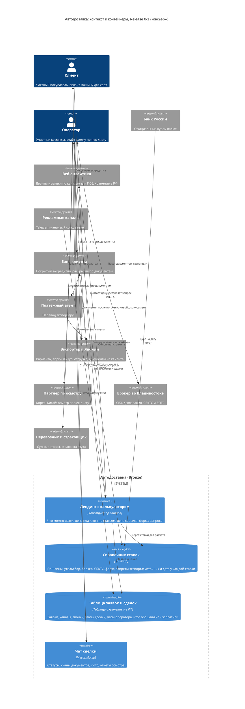
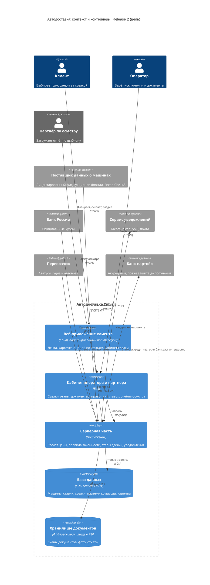

# Технология: что лежит в основе «Автодоставки» (C4 Context + Container)

Для слайдов: 5 (Технология — основной), 4 (Решение: из чего состоит сервис), 6 (Конкуренты: что честно отличает), 10 (Дорожная карта: что автоматизируем и когда).

> Версия 1.0 · Дата: 25.09.2026 · Шаг S09, скилл `dk-c4` (облегчённо: C4 Context + Container). Основано на: `brief.md`, `user-story-map.md` (R0 / R1 / R2+), `unit-economics.md`, `00-context-audit.md` (И9 — данные площадок), `market-research.md`, `lean-canvas.md`. Автономный режим: вопросов команде не задавалось. `discovery/nfr.md` нет — требования к надёжности взяты из брифа и USM.
>
> Язык C4 по-простому: **Context** — кто и какие внешние системы работают с нашим сервисом; **Container** — из каких отдельно работающих частей сервис состоит внутри.

---

## Коротко (для слайда 5)

- **В основе — не уникальная технология, а связка данных и процесса:** справочник ставок с источниками и датами → расчёт цены под ключ по статьям → сделка по чек-листу, где каждый этап подтверждён документом → итог «обещали / заплатили».
- **Своё:** справочник ставок и правила законности (экспортные запреты, 160 л.с.), расчёт по статьям, чек-лист сделки и формат отчётов. **Партнёрское:** машины и выкуп (экспортёр), осмотр (партнёр), защита денег (банк клиента — аккредитив), таможня (брокер), доставка (перевозчик), данные о машинах (лицензированный фид — только в R2). **Заимствованное:** конструктор сайта, таблицы, мессенджер, официальные курсы ЦБ.
- **Честно уникального сейчас нет** (`lean-canvas.md`, раздел 9): калькулятор есть у всех, аккредитив — у Encar Russia и Terminal A. Отличие, которое можно накопить, — публичная история сделок «обещали — получилось» и база реальных итогов по статьям.
- **MVP почти без кода:** 5–10 сделок ведём руками; программировать имеет смысл после подтверждения Г-05, Г-06, Г-07 (`hypotheses.md`).

---

## 1. Обзор системы

**Назначение:** сервис-агент помогает частному покупателю ввезти машину с пробегом из Японии, Кореи или Китая с проверяемой ценой под ключ, защитой денег через банк клиента и статусами сделки с документами (`brief.md`).

**Ключевые пользователи** (`user-story-map.md`, «Роли»): клиент; оператор (участник команды); агент в стране (экспортёр в Японии, партнёр по осмотру в Корее и Китае); таможенный брокер во Владивостоке.

**Внешние зависимости:** банк клиента (аккредитив); платёжный агент (перевод экспортёру); экспортёр и японские аукционы (через экспортёра); партнёр по осмотру; брокер, СВХ, лаборатория СБКТС/ЭПТС; перевозчик (судно, автовоз); страховщик груза; Банк России (официальные курсы); рекламные каналы (Telegram-каналы, Яндекс Директ); в R2 — поставщик данных о машинах.

**Три блока в основе решения** (как в разделе 3 исходного контекста, но с поправками аудита):

| Блок | Что было в контексте | Что стало | Почему |
|---|---|---|---|
| Сбор объявлений | Парсеры Encar, Goonet, китайских площадок каждые несколько часов | R0–R1: ленты нет, варианты под запрос даёт экспортёр-партнёр. R2: лицензированный фид | Encar запрещает автоматический сбор, копирование существенной части чужой базы может нарушать ст. 1334 ГК (`00-context-audit.md`, И9) |
| Калькулятор цены | Пересчёт каждого объявления в рубли | Справочник ставок с источником и датой каждой ставки + расчёт по статьям с диапазоном по курсу | Ставки меняются 2–3 раза в год; ошибка ставки уже была (changes-log п. 42) |
| Интерфейс агента и отчёт осмотра | Своя сеть агентов, интерфейс для агентов | Осмотр у готовых партнёров по чек-листу; для Японии — перевод аукционного листа | Сеть агентов убрана (changes-log п. 44) |
| Оплата | Эскроу в банке-партнёре, деньги уходят продавцу по этапам | Аккредитив, который клиент открывает в своём банке; через счёт ИП идёт только наша комиссия 60 000 ₽ | Эскроу под покупку за рубежом не найдено; сервис не финансирует выкуп (п. 2, 38, 39) |
| Трекинг | Статусы от агента, логистов, брокера | R1: статусы руками со сканом документа; R2: часть статусов от перевозчика | На 5–10 сделок автоматизация не окупается |

---

## 2. Выбор уровня (Gold / Silver / Bronze)

| Вариант | Что это | Стоимость разработки | Время до первой сделки | Подходит нам? |
|---|---|---|---|---|
| **Gold** | Мобильное приложение + бэкенд + лента из фидов + кабинет агента + интеграция с банком | Сотни тысяч рублей и месяцы работы [ДОПУЩЕНИЕ] | 4–6 месяцев [ДОПУЩЕНИЕ] | ❌ нет бюджета, спрос не проверен |
| **Silver** | Веб-сайт с калькулятором и кабинетом клиента, статусы вручную оператором | Десятки тысяч рублей или 1–2 месяца работы команды [ДОПУЩЕНИЕ] | 2–3 месяца | ⏳ Release 2, после 5–10 сделок |
| **Bronze** | Лендинг на конструкторе + калькулятор в таблице + таблица сделок + чат сделки | 0–1 000 ₽ (домен) (`hypotheses.md`, бюджет) | 1–2 недели | ✅ **Release 0 и 1** |

**Выбор: Bronze для R0–R1, Silver — в R2.** Обоснование одной строкой: студенческий проект без бюджета на разработку, ни одна гипотеза не проверена — код до подтверждения Г-05/Г-06/Г-07 был бы ставкой вслепую.

Оценка по векторам (100 — лучше всего для нашей стадии):

| Вектор | Gold | Silver | Bronze |
|---|---|---|---|
| Стоимость | 10 | 50 | 95 |
| Время до проверки гипотез | 10 | 40 | 95 |
| Соответствие закону о данных (152-ФЗ) и правилам площадок | 40 (фиды надо покупать) | 70 | 80 (данные — только заявки и сделки) |
| Масштабируемость (часы оператора на сделку) | 90 | 70 | 30 |
| Надёжность процесса (ничего не потерять) | 80 | 70 | 60 (держится на дисциплине чек-листа) |

Чем жертвуем: Bronze не масштабируется. 12 часов оператора на сделку — базовый сценарий с маржой ≈ 12,4 тыс. ₽; каждый лишний час стоит 900 ₽, при 20 часах маржа ≈ 5,2 тыс. ₽, ноль — около 26 часов (`unit-economics.md`, «в»: 12 + 12 400 / 900 ≈ 25,8). Устойчиво > 12 часов — сигнал переходить на Silver.

---

## 3. Архитектурная диаграмма — Release 0–1 (MVP, Bronze)

Деньги в диаграмме идут мимо сервиса: через наш счёт (ИП) проходит только комиссия 60 000 ₽ (30 000 + 30 000 ₽) (`unit-economics.md`, «ж»). Интеграций с банком, экспортёром и брокером нет — связь через оператора.

---

## 4. Архитектурная диаграмма — Release 2+ (Silver, цель)

---

## 5. Описание компонентов

### Контейнеры (R0–R1)

| Контейнер | Технология (категория) | Назначение | Истории USM | Когда перестаёт хватать |
|---|---|---|---|---|
| Лендинг с калькулятором | Конструктор сайтов; расчёт — формулы | Что можно везти, цена под ключ по статьям, цена сервиса, защита денег, форма запроса | US-001…US-005 | Нужна лента и кабинет (R2) |
| Справочник ставок | Таблица, правит оператор | Единый источник ставок; у каждой — источник, дата, дата следующего изменения | US-002, US-103, SS-101 | Когда ставок и стран станет больше, чем можно сверить руками за час в неделю [ДОПУЩЕНИЕ] |
| Таблица заявок и сделок | Таблица в сервисе с хранением данных в РФ | Заявки, каналы, CPL, звонки; этапы сделки, часы оператора, итог «обещали / заплатили» | US-006, US-007, US-119, SS-001, SS-002, SS-102 | > 10 одновременных сделок [ДОПУЩЕНИЕ] |
| Чат сделки | Мессенджер, отдельный чат на сделку | Статусы, документы, фото, отчёт осмотра | US-104…US-118 | Много вопросов «где машина» (> 1 в неделю на сделку, метрика MVP) |

### Внешние системы и партнёры

| Партнёр / система | Роль | Как работаем в MVP | Запасной вариант | Что нужно проверить |
|---|---|---|---|---|
| **Банк клиента** | Держит деньги за машину на аккредитиве до отгрузки | Клиент открывает сам по инструкции (US-108) | Если ни один банк не согласует (Г-11) — честно: деньги за машину без банковской защиты | Г-11: 3 банка, неделя 1 |
| **Платёжный агент** | Переводит оплату экспортёру (0,5–3,5% — changes-log п. 30) | Выбирает экспортёр / банк клиента | Другой агент | Условия и сроки |
| **Экспортёр в Японии** | Варианты, торги, выкуп, отгрузка, документы на клиента | Договор с 1 партнёром; связь через оператора | Второй экспортёр | Документы на имя клиента [ДОПУЩЕНИЕ]; **готов ли он оплатить аукцион своими деньгами** и получить возмещение из аккредитива после погрузки — [ДОПУЩЕНИЕ], ключевое условие схемы |
| **Партнёр по осмотру** | Корея, Китай: осмотр по чек-листу по себестоимости (Корея 20–30 тыс. ₽ [ИСТОЧНИК: DSS Group, https://dss-g.ru/tpost/iz0lf6eso1-razovaya-viezdnaya-diagnostika-avtomobil, 2026]) | Заказ через оператора (US-106, US-107) | Другой сервис осмотра | Срок и формат отчёта |
| **Брокер во Владивостоке** | СВХ, декларация, СБКТС/ЭПТС (30–50 и 30–35 тыс. ₽ — `unit-economics.md`) | Договор клиента с брокером, пакет документов готовит оператор (US-113) | Второй брокер | Цены, сроки |
| **Перевозчик и страховщик** | Судно, автовоз; страховка 0,25–0,35% груза (`unit-economics.md`, «е») | Заказ оператором | Другие перевозчики | — |
| **Банк России** | Официальный курс на дату для расчёта | Курс берём с сайта / из открытого XML-сервиса ЦБ [ИСТОЧНИК: Банк России, «Получение данных, используя XML», https://cbr.ru/development/sxml/, 2026] | Курс вручную | — |
| **Рекламные каналы** | Трафик для Г-06 | Посевы в Telegram, Директ (15 000 ₽ — `hypotheses.md`) | — | CPL по каналам |
| **Поставщик данных о машинах** (R2) | Лента машин по договору | Не нужен в R0–R1 | Варианты от экспортёра (как в R1) | Готовые фиды аукционов Японии, Encar, Che168 — от 20 000 ₽ подключение + 5 000 ₽/мес [ИСТОЧНИК: web-studio.pro, https://web-studio.pro/api, 2026 — по выдаче, из `00-context-audit.md`]; права на показ клиентам — проверить в договоре |

---

## 6. Потоки данных

### Основной поток R0 (проверка гипотез)
Реклама → лендинг (калькулятор берёт ставки из справочника, курс ЦБ) → запрос с меткой канала → таблица заявок → уведомление оператору → звонок с ценой 60 000 ₽ и предзаписью → итог звонка в таблицу → подсчёт Г-02, Г-05, Г-06, Г-08 в день 13 (`hypotheses.md`, план).

### Основной поток R1 (сделка)
Договор и депозит 30 000 ₽ на счёт ИП → варианты от экспортёра → аукционный лист с переводом или отчёт осмотра → клиент открывает аккредитив в своём банке (до торгов — это гарантия для экспортёра) → торги и выкуп: аукцион оплачивает экспортёр своими деньгами [ДОПУЩЕНИЕ] → доставка до порта и погрузка на судно (1–3 недели) → коносамент на имя клиента (скан в чат) → банк раскрывает аккредитив по инвойсу, экспортным документам и коносаменту → платёжный агент возмещает экспортёру → Владивосток: брокер, пошлина и утильсбор по квитанциям на клиента → СБКТС/ЭПТС → автовоз → акт приёма с фото → остаток 30 000 ₽ → отчёт «обещали / заплатили».

### Какие данные о клиенте храним и где
Имя, телефон, запрос — с лендинга; паспорт, доверенность — только для брокера и экспортных документов. С 01.07.2025 сбор персональных данных граждан РФ с использованием баз данных за рубежом прямо запрещён (ч. 5 ст. 18 152-ФЗ) [ИСТОЧНИК: Lidings, https://www.lidings.com/ru/media/legalupdates/localization_pd_update/, 2025; comply.ru, https://comply.ru/tpost/c43ezsout1-lokalizatsiya-i-transgranichnaya-peredac, 2025]; штраф за нарушение локализации — до 18 млн ₽ (верхняя граница — повторное нарушение для юрлица; для ИП меньше) [ИСТОЧНИК: cloud.ru, https://cloud.ru/blog/152-fz, 2025 — по выдаче]. Поэтому конструктор, таблица и форма должны хранить данные в РФ, а сканы паспортов не лежат в общем чате — только в защищённой папке с хранением в РФ и доступом оператора [ДОПУЩЕНИЕ: выбор конкретного сервиса — команде, проверить, где он хранит данные]. Уведомление Роскомнадзора об обработке персональных данных (ст. 22 152-ФЗ) [ИСТОЧНИК: 152-ФЗ «О персональных данных», КонсультантПлюс, https://www.consultant.ru/document/cons_doc_LAW_61801/, ред. 2026] — обязанность оператора ПДн, подать до запуска лендинга R0; на сайте нужны политика обработки ПДн и согласие в форме заявки.

---

## 7. Ключевые решения

| Решение | Выбор | Почему | Альтернативы |
|---|---|---|---|
| Уровень реализации MVP | Bronze: конструктор + таблицы + чат | 0–1 000 ₽, 1–2 недели; гипотезы не проверены | Silver (сайт с кабинетом) — R2; Gold — нет |
| Источник данных о машинах | R0: не нужен; R1: варианты от экспортёра; R2: лицензированный фид | Парсинг запрещён правилами Encar и может нарушать ст. 1334 ГК (И9) | Парсинг — только как осознанный риск, не рекомендуем; партнёрская программа площадки — искать |
| Защита денег | Аккредитив клиента в его банке + страховка + документы на клиента + вторая половина комиссии после получения | Реализуемо без нашего капитала (`unit-economics.md`, «е») | Эскроу — не найдено; защита до регистрации — нужен капитал ~1 млн ₽ на сделку (R2+ с банком) |
| Расчёт цены | Справочник ставок с источником и датой + диапазон по курсу ±10% | Ставки меняются 2–3 раза в год; честность = отличие | «Одна цифра» без раскладки — как у многих конкурентов |
| Статусы сделки | Руками, каждый этап со сканом | 5–10 сделок; трекинг — гигиена рынка (п. 28) | Автоматические статусы от перевозчика — R2 |
| Хранение данных | Сервисы с хранением в РФ, паспорта отдельно от чата | 152-ФЗ, ч. 5 ст. 18 (с 01.07.2025) | Зарубежные таблицы и формы — нельзя |

---

## 8. Что честно уникально (и что нет)

| Утверждение | Правда? | Комментарий |
|---|---|---|
| «Уникальная технология / ИИ-подбор / своя платформа» | ❌ | Ничего такого нет и в MVP не будет. На слайде не пишем |
| Калькулятор цены под ключ | ❌ не уникально | Есть у Дрома, Регион Авто и многих посредников (`market-research.md`, таблица сравнения) |
| Аккредитив как защита денег | ❌ не уникально | Есть у Encar Russia и Terminal A (Корея, Китай); по Японии у конкурентов не найден — [ГИПОТЕЗА] преимущество, проверяется H-005 |
| Документ по каждой статье + раскрытый курс + отчёт «обещали / заплатили» | ◐ редкость | Среди найденных конкурентов такого обещания нет (`market-research.md`, раздел про отличия), но скопировать можно за неделю |
| История реальных сделок и база итогов по статьям | ✅ накапливаемое | Копируется только временем; появится после первых сделок |

**Формулировка для слайда 5:** «Наша основа — не технология, а проверяемый процесс: справочник ставок с источниками, расчёт по статьям, банк клиента вместо предоплаты посреднику и документ на каждом этапе. MVP — на готовых инструментах, код — после подтверждения спроса».

---

## 9. Риски и альтернативы

| Риск | Чем грозит | Что делаем / альтернатива |
|---|---|---|
| Данные площадок без разрешения (И9) | Блокировка, иск (может нарушать ст. 1334 ГК), запрет Encar | Нет ленты в MVP; в R2 — фид по договору или партнёрская программа; парсинг не используем |
| Корейский экспортный контроль ужесточается (задержаны экспортёры за серые поставки — `brief.md`, риски) | Сделки из Кореи срываются | Фокус на Японию в R1 |
| Экспортёр не готов оплатить аукцион своими деньгами до раскрытия аккредитива | Схема «деньги в банке до отгрузки» не работает: клиенту придётся платить до погрузки | Искать экспортёра, который работает под аккредитив (как у конкурентов в Корее и Китае — `market-research.md`); иначе честно: защита только до выкупа |
| Банк не согласует аккредитив по коносаменту (Г-11) | Нет банковской защиты денег | Честная формулировка без защиты; страховка + документы на клиента |
| Ошибка ставки в справочнике | Гарантийная выплата до 60 000 ₽ | Источник и дата у каждой ставки, сверка на 15 машинах (Г-09), напоминание при изменении (SS-101) |
| Утечка или зарубежное хранение паспортных данных | Штраф (до 18 млн ₽ для юрлица при повторном нарушении) | Сервисы с хранением в РФ, паспорта не в общем чате, минимум доступа |
| Bronze не масштабируется | > 12 часов оператора на сделку — маржа тает (≈ 5,2 тыс. ₽ при 20 ч, ноль при ~26 ч) | Порог перехода на Silver — метрика MVP (`hypotheses.md`, раздел 7) |

---

## Допущения и открытые вопросы

**Уровень неопределённости:** все 4 критических раздела (акторы, внешние системы, контейнеры, связи) и все 4 вспомогательных (потоки, решения, риски, персональные данные) заполнены; незаполненных 0 → 0/4 × 0,7 + 0/4 × 0,3 = **0,00** по заполненности. Содержательная неопределённость — ниже.

- [ДОПУЩЕНИЕ] Стоимость и сроки Gold/Silver — оценка на глаз, без смет.
- [ДОПУЩЕНИЕ] Пороги перехода с таблиц (> 10 сделок одновременно, > 1 часа в неделю на сверку ставок) — на глаз.
- [ДОПУЩЕНИЕ] Японский экспортёр оформляет экспортные документы и коносамент на имя клиента.
- [ДОПУЩЕНИЕ] Конкретные сервисы (конструктор, таблицы, мессенджер) не выбраны: главный критерий — хранение персональных данных в РФ.
- Открыто: кто финансирует выкуп на аукционе до погрузки — готов ли экспортёр платить своими деньгами 1–3 недели и сколько это стоит клиенту (в `unit-economics.md`, «г», раскрытие стоит сразу после выкупа — поправить в S12);
- Открыто: какой банк подтвердит аккредитив (Г-11); кто экспортёр и брокер; права на показ данных фида клиентам; кто и когда подаёт уведомление в Роскомнадзор (до R0, раздел 6); касса по 54-ФЗ (`unit-economics.md`, «ж»).
- Открыто: партнёрские программы площадок (Encar, японские аукционы через AJES — доступ дилерам по запросу, `00-context-audit.md`) — не изучены по договорам.
